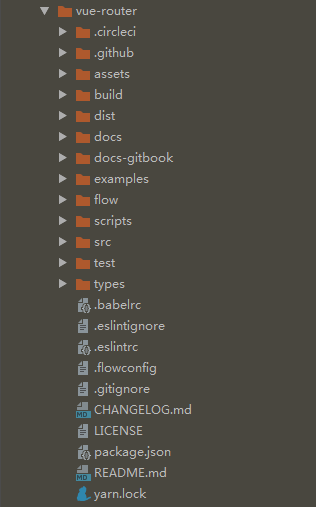
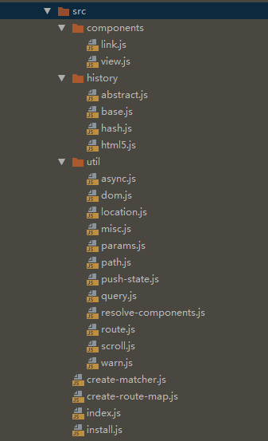

## vue-router 简介
Vue Router 是 Vue.js 官方的路由管理器。 

包含的功能有： 

- 嵌套的路由/视图表
- 模块化的、基于组件的路由配置
- 路由参数、查询、通配符
- 基于 Vue.js 过渡系统的视图过渡效果
- 细粒度的导航控制
- 带有自动激活的 CSS class 的链接
- HTML5 历史模式或 hash 模式，在 IE9 中自动降级
- 自定义的滚动条行为

## vue-router 源码结构
我们使用git工具下载最新的vue-router源码([https://github.com/vuejs/vue-router.git](https://github.com/vuejs/vue-router.git))。 目前最新的版本3.0.6，后面的代码分析都使用该版本。 

我们先大致看一下vue-router项目的目录结构： 

 

对目录的一些简要说明如下： 
```vuejs
├ assets     // 静态资源目录
├ build      // 编译配置目录
├ dist       // 打包后的文件目录
├ docs       // 文档源码目录
├ docs-gitbook  // 文档gitbook版目录
├ examples   // 功能示例目录
├ flow       // flow声明文件目录
├ scripts    // 一些命令目录 
├ src        // 功能源码目录 
├ test       // 代码测试目录
└ types      // types类型文件目录 
```

其中我们重点要分析的就是src源码目录代码和examples示例目录代码。 

## vue-router 解析要点
这里我们先看看vue-router项目的src源码目录 

 

对目录文件的一些简要说明如下： 

```vuejs
src
├ components  //组件目录
│   ├ link.js   //组件route-link的实现
│   └ view.js   //组件route-view的实现
│
├ history     //history功能目录
│   ├ base.js      //基本的history
│   ├ abstract.js  //非浏览器的history
│   ├ hash.js      //hash模式的history
│   └ html5.js     //html5模式的history
│
├─ util      //工具目录
│     ├── async.js       //异步操作的工具库
│     ├── dom.js         //dom相关的函数
│     ├── location.js    //对location的处理
│     ├── misc.js        //一个工具方法
│     ├── params.js      //处理参数
│     ├── path.js        //处理路径
│     ├── push-state.js  //处理html模式的 pushState
│     ├── query.js       //对query的处理
│     ├── resolve-components.js  //异步加载组件
│     ├── route.js       //路由
│     ├── scroll.js      //处理滚动
│     └── warn.js        //打印一些警告
│
├ create-matcher.js  //创建匹配
├ create-route-map.js  //创建路由的映射
├ index.js   //入口文件
└ install.js  //插件安装方法
```

## 参考
- [https://router.vuejs.org/zh/](https://router.vuejs.org/zh/)
- [https://www.cnblogs.com/caizhenbo/p/7297730.html](https://www.cnblogs.com/caizhenbo/p/7297730.html)
- [https://www.cnblogs.com/zhangycun/p/9403339.html](https://www.cnblogs.com/zhangycun/p/9403339.html)
- [https://segmentfault.com/a/1190000018051526](https://segmentfault.com/a/1190000018051526)