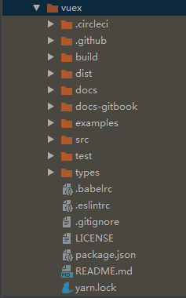
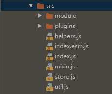

## vuex简介
Vuex 是一个专为 Vue.js 应用程序开发的状态管理模式。它采用集中式存储管理应用的所有组件的状态，并以相应的规则保证状态以一种可预测的方式发生变化。

直白一点，vuex就是把组件的共享状态抽取出来，以一个全局单例模式管理的数据仓库，里面提供了对应用的数据存储和对数据的操作，维护整个应用的公共数据。

## vuex源码结构
我们使用git工具下载最新的vuex源码([https://github.com/vuejs/vuex.git](https://github.com/vuejs/vuex.git))。 目前最新的版本3.1.1，后面的代码分析都使用该版本。

我们先大致看一下vuex项目的目录结构：

对目录的一些简要说明如下：
├ build      // 编译配置目录
├ dist       // 打包后的文件目录
├ docs       // 文档源码目录
├ docs-gitbook  // 文档gitbook版目录
├ examples   // 功能示例目录
├ src        // 功能源码目录 
├ test       // 代码测试目录
└ types      // types类型文件目录 

其中我们重点要分析的就是src源码目录代码和examples示例目录代码。

## vuex解析要点
这里我们先看看vuex项目的src源码目录

对目录文件的一些简要说明如下：

src
├ module  //模块管理目录
│   ├ module-collection.js   //创建组模块树
│   └ module.js   //创建模块
│
├ plugins     //插件目录目录
│   ├ devtool.js    //开发工具插件
│   └ logger.js     //日志插件
│
├ helpers.js    //mapSate,mapMutations,mapActions,mapGetters 等操作函数
├ index.esm.js  //入口文件，用于es-module打包
├ index.js      //入口文件，用于commonjs打包
├ mixin.js      //注入方法，将store挂载到vue实例
├ store.js      //核心代码，创建store对象
└ util.js       //工具类，deepClone、isPromise等函数

我们先大致了解下每个文件的作用说明。

## 小结
使用过vuex的朋友肯定都知道，vuex的核心其实就是state、getter、mutation、action、module这五大部分。接下来，我们将主要围绕这些核心东西来解析vuex的源码。

## 相关
- [https://vuex.vuejs.org/zh/](https://vuex.vuejs.org/zh/)
- [https://segmentfault.com/a/1190000014363436](https://segmentfault.com/a/1190000014363436)
- [https://www.cnblogs.com/chenmeng2062/p/9337650.html](https://www.cnblogs.com/chenmeng2062/p/9337650.html)
- [https://blog.csdn.net/sinat_17775997/article/details/62231288](https://blog.csdn.net/sinat_17775997/article/details/62231288)
- [https://www.cnblogs.com/caizhenbo/p/7380200.html](https://www.cnblogs.com/caizhenbo/p/7380200.html)
