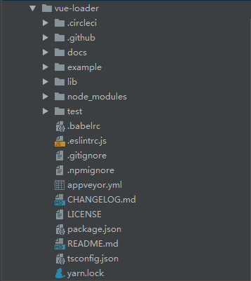

## vue-loader 简介
* 官方介绍：`Vue Loader` 是一个 `webpack` 的 `loader`，它允许你以一种名为单文件组件( `SFCs` )的格式撰写 `Vue` 组件。
* 粗鲁的讲：`Vue-loader` 就是将 `.vue` 文件变成 `.bundle.js`，然后放入浏览器能直接运行的工具。

## vue-loader 源码结构
* 我们使用git工具下载最新的vue-loader源码([https://github.com/vuejs/vue-loader.git](https://github.com/vuejs/vue-loader.git))。 目前最新的版本15.7.0，后面的代码分析都使用该版本。
* 我们先大致看一下vue-loader项目的目录结构：

* 对目录的一些简要说明如下：
├ docs      // 项目文档目录 
├ example   // 功能示例目录 
├ lib       // 项目源码目录
└ test      // 功能测试目录 

## vue-router 解析要点
* 这里我们先看看vue-loader项目的lib源码目录文件

* 对目录文件的一些简要说明如下：
lib
├ codegen     //代码生成目录
│   ├ customBlock.js     //
│   ├ hotReload.js       //
│   ├ styleInjection.js  //
│   └ utils.js           //
│
├ loaders     //loader功能目录
│   ├ pitcher.js          //
│   ├ stylePostLoader.js  //
│   └ templateLoader.js   //
│
├─ runtime   //运行时功能目录
│     └── componentNormalizer.js  //
│
├ index.js    //入口文件
├ plugin.js   //插件安装方法
└ select.js   //
* 我们先大致了解下每个文件的作用说明。

## 小结
* 既然vue-loader就是`.vue` 文件变成 `.bundle.js`的工具，那么我们大概可以猜一猜vue-loader的核心功能就包含.vue输入文件的代码分离、分离后的代码语言编译转换等功能。下面将一一道来。

## 相关
* [https://vue-loader.vuejs.org/zh/](https://vue-loader.vuejs.org/zh/)
* [https://segmentfault.com/a/1190000012207211](https://segmentfault.com/a/1190000012207211)
* [https://blog.csdn.net/qq_41999617/article/details/83007001](https://blog.csdn.net/qq_41999617/article/details/83007001)
* [https://nicholaslee119.github.io/2017/12/01/vueLoader%E6%BA%90%E7%A0%81%E8%A7%A3%E6%9E%90%E7%B3%BB%E5%88%97%E4%B9%8Bselector/](https://nicholaslee119.github.io/2017/12/01/vueLoader%E6%BA%90%E7%A0%81%E8%A7%A3%E6%9E%90%E7%B3%BB%E5%88%97%E4%B9%8Bselector/)